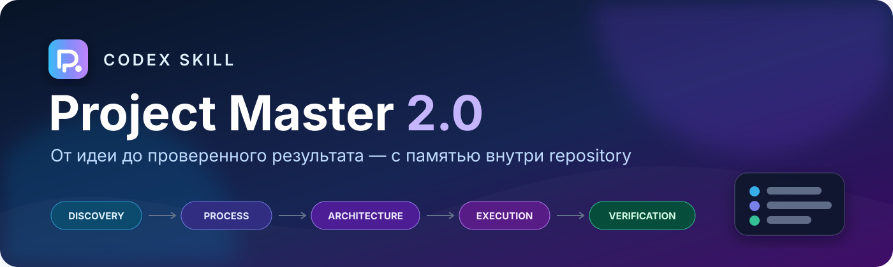
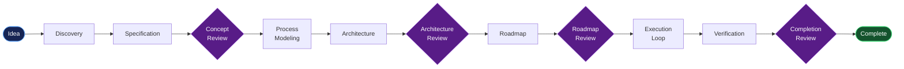

<div align="center">
  
</div>

<p align="center">
  <a href="https://github.com/Sovetov-AS/project-master/actions/workflows/ci.yml"></a>
  
  
  
  
</p>

<p align="center">
  <strong>Глобальный Codex skill, который ведёт сложный проект от неструктурированной идеи до проверенного результата.</strong>
</p>

<p align="center">
  Репозиторная память · Human gates · BPMN · Architecture Decisions · Roadmap · Recovery · Verification
</p>

---

## Зачем нужен Project Master

Обычный диалог с AI плохо подходит для долгих проектов: контекст сжимается, решения забываются, scope разъезжается, а написанный код легко принять за готовый результат.

Project Master переносит память проекта из разговора в repository и вводит управляемый жизненный цикл:

- проводит адаптивное Discovery вместо формальной анкеты;
- фиксирует требования со стабильными ID;
- моделирует процессы в BPMN 2.0;
- отделяет утверждение концепции, процессов, архитектуры и roadmap;
- разрешает только один активный component одновременно;
- восстанавливает контекст после новой сессии или compaction;
- обнаруживает requirement, process, architecture, implementation и state drift;
- не объявляет работу завершённой без verification evidence.

> **Conversation history не является памятью проекта.** Новый экземпляр Codex должен восстановить проект только по файлам repository.

## Жизненный цикл



Полная редактируемая диаграмма включена в skill: [`PM-001-project-master-lifecycle.bpmn`](assets/templates/PM-001-project-master-lifecycle.bpmn).

## Быстрый старт

### 1. Установите глобальный skill

```bash
mkdir -p "$HOME/.agents/skills"
git clone git@github.com:Sovetov-AS/project-master.git \
  "$HOME/.agents/skills/project-master"
```

Для установки по HTTPS:

```bash
git clone https://github.com/Sovetov-AS/project-master.git \
  "$HOME/.agents/skills/project-master"
```

После установки откройте новую задачу Codex, чтобы каталог USER-level skills перечитался.

### 2. Откройте любой repository

### 3. Запустите Project Master

```text
$project-master
```

Или передайте идею сразу:

```text
$project-master start Сервис согласования клиентских заказов
```

Project Master создаст локальную память проекта и начнёт Discovery. Production-код на этом этапе не пишется.

## Движок глобальный, память локальная

```text
$HOME/.agents/skills/project-master/     <PROJECT_ROOT>/.project-master/
┌─────────────────────────────────┐     ┌─────────────────────────────────┐
│ SKILL.md                        │     │ STATE.yaml                      │
│ references/                     │     │ CURRENT_STATE.md                │
│ scripts/                        │     │ REQUIREMENTS.md                 │
│ assets/templates/               │     │ processes/*.bpmn               │
│                                 │     │ ARCHITECTURE.md + ADR           │
│ Общий движок для всех проектов  │     │ ROADMAP + phases + components   │
└─────────────────────────────────┘     └─────────────────────────────────┘
```

Project-specific state никогда не хранится в глобальном skill. Проекты не смешивают состояния между собой.

## Основные команды

| Команда | Что делает |
|---|---|
| `$project-master` | Автоматически запускает новый проект или возобновляет существующий |
| `$project-master start <idea>` | Создаёт project memory и начинает Discovery |
| `$project-master resume` | Восстанавливает контекст без истории разговора |
| `$project-master status` | Показывает краткий текущий статус |
| `$project-master next` | Выполняет следующий разрешённый шаг |
| `$project-master process list` | Показывает процессы и расхождения BPMN/sidecar |
| `$project-master process sync PROC-001` | Синхронизирует изменённую вручную BPMN-модель |
| `$project-master change <description>` | Создаёт предложение изменения scope |
| `$project-master verify` | Проверяет active component или phase |
| `$project-master audit` | Ищет drift между источниками истины |
| `$project-master finish` | Запускает completion review, но не обходит approval |

## Human gates

Project Master не начинает реализацию только потому, что «вроде всё понятно». Обязательные решения product owner:

1. Concept Approval
2. Key Process Approval
3. Architecture Approval
4. Roadmap Approval
5. Scope Change Approval — только если меняется утверждённый scope
6. Project Completion Approval

Повторное подтверждение не требуется, пока утверждённый предмет не изменился.

## BPMN как source of truth

Процессы хранятся в `.project-master/processes/` как BPMN 2.0 XML:

```text
processes/
├── as-is/      # существующие процессы
├── to-be/      # проектируемые процессы
└── system/     # системные workflow
```

Каждая диаграмма имеет Markdown sidecar с назначением, участниками, inputs/outputs, исключениями и связями с requirements/components/ADR.

Для визуального редактирования:

1. откройте `.bpmn` в Camunda Modeler;
2. измените процесс и сохраните файл;
3. напишите `$project-master process sync PROC-XXX`.

Project Master проверит XML и ссылки, определит изменение по SHA-256, сопоставит его с requirements, architecture и roadmap. Существующие BPMN IDs и layout не перегенерируются без причины.

## Источники истины

| Артефакт | Отвечает за |
|---|---|
| `STATE.yaml` | Машинное состояние и текущий active path |
| `VISION.md` | Проблему, цель и ожидаемый результат |
| `REQUIREMENTS.md` | Утверждённые функциональные и нефункциональные требования |
| `*.bpmn` | Последовательность действий внутри процессов |
| `ARCHITECTURE.md` | Техническое устройство системы |
| `ADR-*` | Причины важных архитектурных решений |
| `ROADMAP.md` | Декомпозицию проекта на phases и components |
| Component file | Контракт конкретной реализации |
| Tests / evidence | Доказательство выполнения |

Если источники противоречат друг другу, Project Master не выбирает победителя молча: конфликт фиксируется и при необходимости проходит Change Control.

## Что происходит перед каждой реализацией

```text
RECOVER → LOAD CONTRACT → UNDERSTAND → IMPLEMENT
        → TEST → VERIFY → REVIEW → PERSIST → ADVANCE
```

Перед production-изменением загружаются только релевантные документы: state, active phase, active component, связанные requirements, BPMN и ADR. Это снижает расход контекста и защищает проект от drift.

## Безопасные ограничения

- Никакого production implementation до обязательных approvals.
- Не более одного ACTIVE component.
- Никакого COMPLETE без сохранённого evidence.
- Scope change не реализуется автоматически.
- Существующий `AGENTS.md` не перезаписывается.
- Существующая `.project-master/` не уничтожается.
- Commit зависит от `git_checkpoint_mode`; push всегда требует отдельного разрешения.
- После трёх однотипных технических неудач срабатывает Three-Strike Protocol.

## Структура skill

<details>
<summary>Показать дерево</summary>

```text
project-master/
├── SKILL.md
├── agents/openai.yaml
├── references/
│   ├── lifecycle.md
│   ├── discovery.md
│   ├── specification.md
│   ├── process-modeling.md
│   ├── architecture.md
│   ├── roadmap.md
│   ├── execution.md
│   ├── recovery.md
│   ├── change-control.md
│   ├── verification.md
│   └── completion-audit.md
├── scripts/
│   ├── init_project.py
│   ├── state.py
│   ├── validate_project.py
│   ├── validate_bpmn.py
│   └── traceability.py
├── assets/templates/
└── tests/test_project_master.py
```

</details>

## Проверка

Skill не требует production-зависимостей: достаточно Python 3.9+.

```bash
python3 -m unittest discover -s tests -v
python3 scripts/validate_bpmn.py \
  assets/templates/PM-001-project-master-lifecycle.bpmn
```

Тестовый набор проверяет 15 сценариев: state gates, recovery, изоляцию проектов, единственный ACTIVE component, сохранение `AGENTS.md`, BPMN sync detection, evidence gate, Change Review и Completion Review.

Если `bpmnlint` доступен локально, `validate_bpmn.py` добавляет semantic lint. Без него basic validation продолжает работать и явно сообщает `SEMANTIC LINT NOT AVAILABLE`.

## Обновление

```bash
cd "$HOME/.agents/skills/project-master"
git pull --ff-only
```

Обновление глобального движка не перезаписывает project memory. Если версия schema проекта устарела, сначала создайте read-only migration plan:

```bash
python3 "$HOME/.agents/skills/project-master/scripts/init_project.py" \
  --root /path/to/project \
  --upgrade-plan
```

---

<p align="center">
  <strong>Project Master 2.0</strong><br>
  Сложный проект должен переживать потерю контекста — и всё равно оставаться управляемым.
</p>
